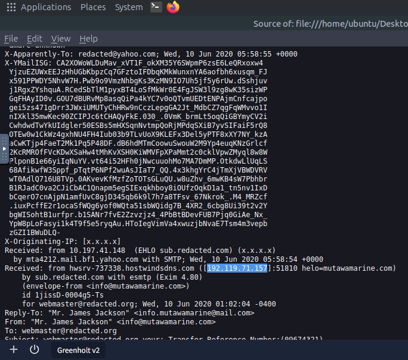
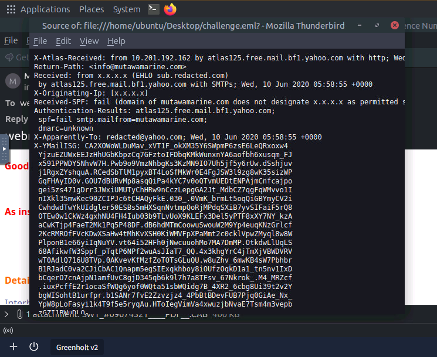
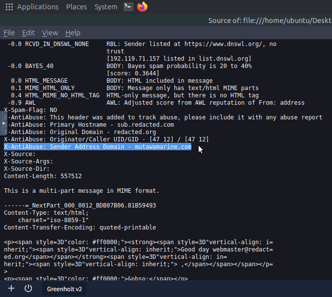
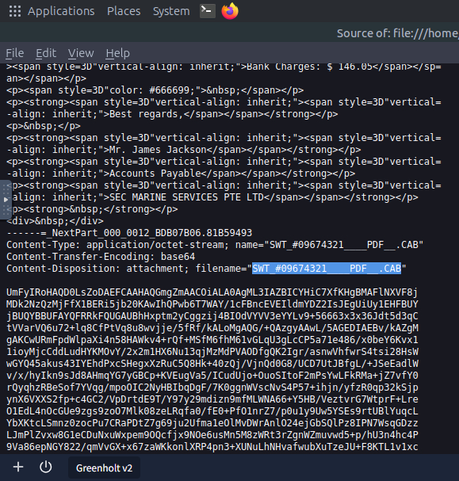
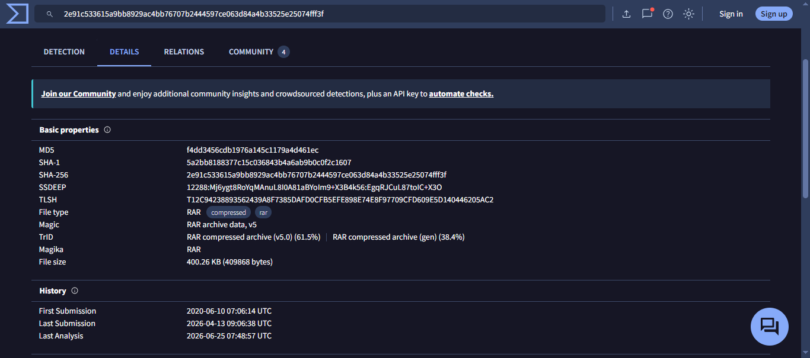
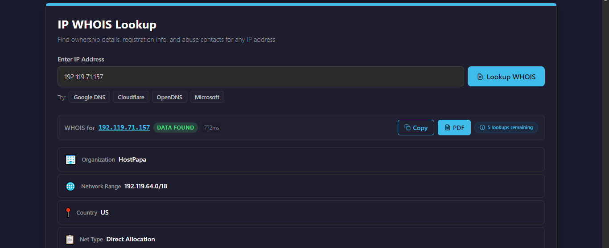
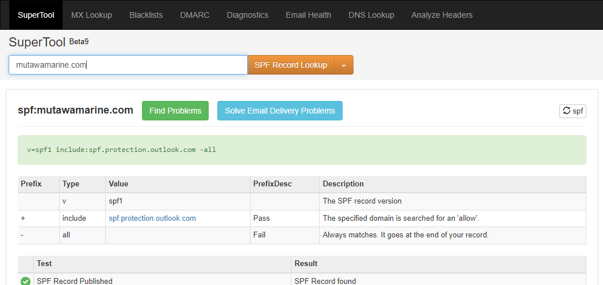
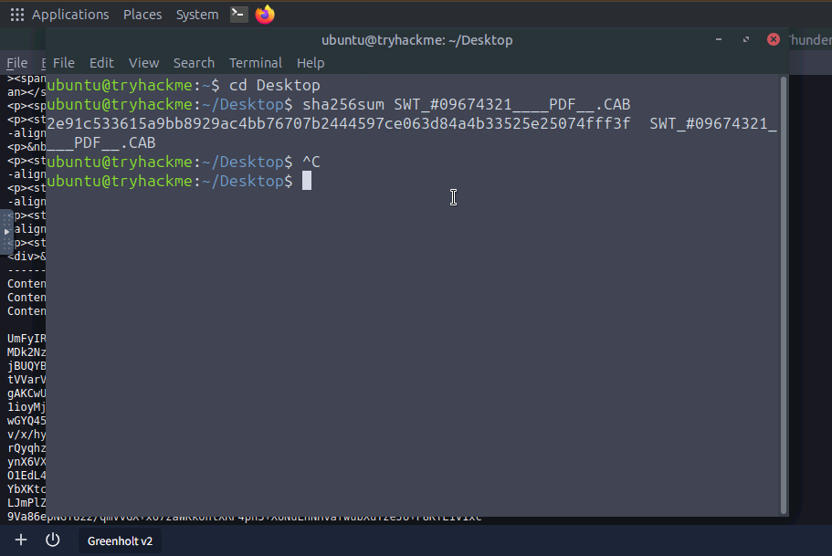
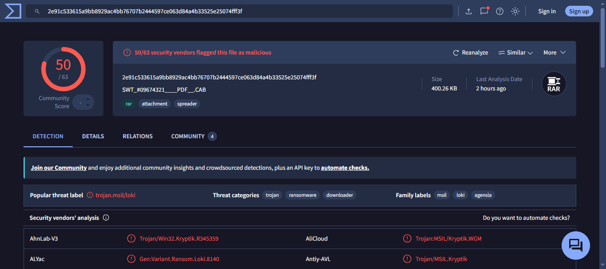

# Phishing Email Investigation: Greenholt PLC

A sales executive at Greenholt PLC escalated a suspicious email requesting an urgent money transfer from what appeared to be a known customer. I analyzed the raw message source to trace its origin, verify the sender's authentication records, and assess the attached file.

---

## Task 1: Reading the Email Headers

### 1. The Threat
The email appeared to come from a legitimate business contact, but the generic greeting and unexpected payment request raised immediate concerns.

### 2. Analysis & Detection Strategy
The standard email view only shows the display name, subject line, and body. The actual routing data is stored in the raw source headers. I opened the `.eml` file in Thunderbird and viewed the raw message source to read the true sender metadata and delivery path.



### 3. Findings
Reading the top-level header fields exposed the core identifiers:
* **Subject Line Reference:** `09674321`
* **Sender Display Name:** `Mr. James Jackson`
* **Sender Email Address:** `info@mutawamarine.com`
* **Reply-To Address:** `info@mutawamarine.com`

---

## Task 2: Tracing the Sending Infrastructure

### 1. The Threat
Attackers often send email through servers that have no connection to the domain they claim to represent. Tracing the actual delivery path exposes that gap.

### 2. Analysis & Detection Strategy
I worked backwards through the `Received:` headers to identify the first server that handled the message. I then ran the IP address through WHOIS to find the hosting provider and used MxToolBox to pull the domain's published SPF and DMARC records.



### 3. Findings
* **Originating IP:** `192.119.71.157`
* **Hosting Provider:** `HostPapa`



* **SPF Record:** `v=spf1 include:spf.protection.outlook.com -all`
* **DMARC Record:** `v=DMARC1; p=quarantine; fo=1`

The `-all` at the end of the SPF record means any server not explicitly listed should be rejected. Since `192.119.71.157` was not on that list, the result was an **SPF Fail**: the sending server had no authorization to send email on behalf of `mutawamarine.com`.





---

## Task 3: Analyzing the Attachment

### 1. The Threat
The email included a file with a name designed to look like a PDF document. Opening an unknown attachment directly on an analyst machine risks executing malware.

### 2. Analysis & Detection Strategy
I checked the MIME headers in the raw source to identify the real filename and encoding method. I then generated a SHA256 hash of the file. Submitting a hash to VirusTotal checks it against existing threat data without opening or running the file itself.



```bash
sha256sum SWT_#09674321_____PDF___.CAB
```



### 3. Findings
The attachment was not a PDF. The filename used trailing spaces and a misleading extension to disguise a compressed archive:
* **Filename:** `SWT_#09674321_____PDF___.CAB`
* **SHA256:** `2e91c53315a9bb8929ac4bb76707b2444597ce063d84a4b33525e25074fff3f`
* **File Size:** `400.26 KB`
* **True File Type:** RAR archive (v5)
* **VirusTotal Result:** 50 of 63 vendors flagged it as malicious, identified as `trojan.msil/loki`





---

## Task 4: Incident Response & Remediation

### 1. Immediate Containment
The first priority is stopping active damage before any deeper investigation:
* **Isolate the endpoint:** If the executive opened the attachment, take the workstation off the network immediately to stop the trojan from making outbound connections or spreading to other machines.
* **Block the originating IP at the firewall:** Add `192.119.71.157` to the deny list to cut off any active traffic from the same server.
* **Block the sender domain at the email gateway:** Add `mutawamarine.com` to the inbound blocklist. The domain is either compromised or controlled by the attacker.
* **Deploy the file hash to endpoint protection:** Push `2e91c53315a9bb8929ac4bb76707b2444597ce063d84a4b33525e25074fff3f` as a quarantine rule so the file is blocked automatically if it appears on any other machine.

### 2. Scope Assessment
Determine whether this was a single-target attempt or part of a wider campaign:
* Pull mail gateway logs and check whether any other internal users received messages from `info@mutawamarine.com` or from the same IP range.
* Scan endpoint logs for file creation events matching the attachment filename or SHA256 hash.
* If the attachment was opened, review outbound network connections for activity consistent with the Loki trojan.

### 3. Hardening & Prevention
Address the structural gaps this attack exposed:
* **Enforce SPF rejection at the gateway:** The domain's SPF uses `-all`, but the message still reached the inbox. Review the mail gateway configuration to ensure SPF failures result in outright rejection, not just a flagged header.
* **Escalate DMARC enforcement:** If Greenholt PLC owns its own sending domain, move the DMARC policy from `p=quarantine` to `p=reject` to block lookalike domain abuse entirely.
* **Block misleading filename patterns:** Configure the email gateway to flag attachments where the filename uses a false extension structure such as `.PDF___.CAB`.
* **User awareness:** Brief the sales team on unsolicited payment requests. A generic greeting combined with an unexpected attachment are standard warning signs.

### 4. Reporting
* Notify HostPapa's abuse team at `abuse@hostpapa.com` with the originating IP and message headers so the server can be reviewed.
* Document all indicators and file an internal incident report.

---

## IOC Summary

| Type | Value | Verdict |
|---|---|---|
| Sender IP | `192.119.71.157` | Malicious (HostPapa-hosted sending node) |
| Sender Domain | `mutawamarine.com` | Spoofed / Compromised (SPF Hard Fail) |
| Attachment Filename | `SWT_#09674321_____PDF___.CAB` | Malicious (false extension masquerading as PDF) |
| SHA256 Hash | `2e91c53315a9bb8929ac4bb76707b2444597ce063d84a4b33525e25074fff3f` | 50/63 VT vendors, `trojan.msil/loki` |
| True File Type | RAR archive (v5) disguised as CAB/PDF | Obfuscated container |

---

## MITRE ATT&CK Mapping

| Technique ID | Name | Observed Behavior |
|---|---|---|
| T1566.001 | Phishing: Spearphishing Attachment | Unsolicited email with malicious attachment targeting a sales executive |
| T1036.007 | Masquerading: Double File Extension | `.PDF___.CAB` filename exploiting hidden extension defaults |
| T1204.002 | User Execution: Malicious File | Payload requires the recipient to open the attachment |
| T1071 | Application Layer Protocol | Potential outbound connection established post-execution by Loki trojan |

---

## The Real-World Lesson
Attackers layer obfuscation to exploit default OS behavior. In this case, the file extension was hidden from a user whose system doesn't display them by default. Email headers and file hashes don't lie even when display names and filenames do. Cross-referencing authentication results against threat intelligence data is what separates a delivered payload from a blocked one.
