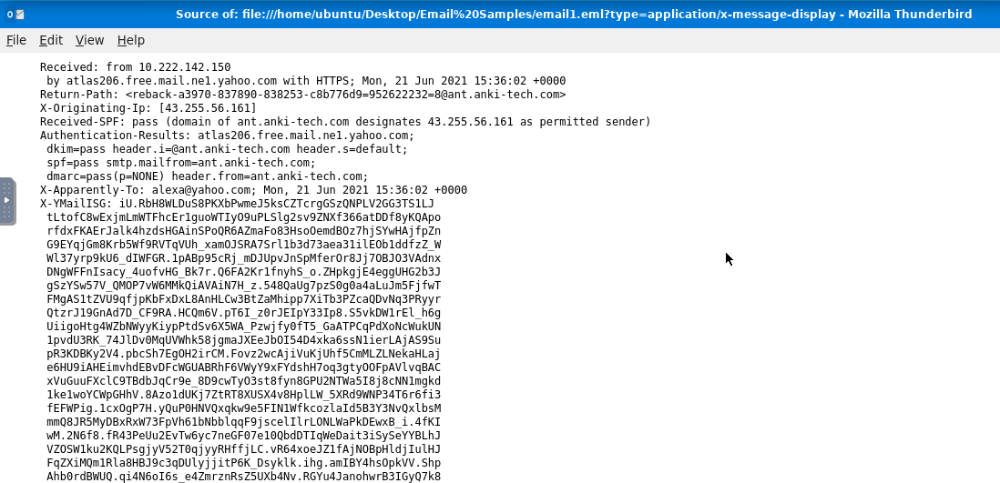

# Incident Response: Phishing & Email Forensic Analysis

This repository documents my hands-on analysis of malicious email samples using an analyst workstation. The goal was to look past the standard inbox view, dissect raw email headers (`.eml` files), decode hidden attachments, and extract indicators of compromise (IoCs) used in active phishing campaigns.

---

## Task 1: Dissecting Raw Email Headers (email1.eml)

### 1. The Anatomy
When an email hits an inbox, the standard user view hides the technical metadata. To investigate, I analyzed the raw message source in Thunderbird (`Ctrl + U`) to reveal the true delivery path.

### 2. Forensic Discovery
By auditing the top-level metadata and tracking the server hops, I extracted the primary identification markers:
* **Full Subject Line:** `Help protect your budget by protecting your home`
* **X-Originating-IP:** `43.255.56.161`

---

## Task 2: Reconstructing Base64 Attachments (email2.txt)

### 1. The Anatomy
Attackers frequently embed malicious files directly into the raw source text of an email using Base64 encoding. To the naked eye, this looks like a massive block of randomized characters, but it can be reverse-engineered cleanly.

### 2. Forensic Discovery
I opened the raw file to inspect the MIME multi-part headers and isolate how the file was packed:
* **Content-Type:** `application/pdf`
* **Attachment Name:** `zmqpalgh.pdf`

### 3. The Replay
Because the email client stores this file as a long Base64 string, I extracted the raw data block and ran it through a decoder to rebuild the original physical PDF. 
* **Hidden Flag Value:** `THM{BENIGN_PDF_ATTACHMENT}`

---

## Task 3: Defanging & Triage (email3.eml)

### 1. The Anatomy
In this scenario, a reputable organization was actively impersonated using common brand-spoofing techniques designed to create false trust and trick the recipient into a fast reaction.

### 2. Safe Analysis Tactics
Before looking at any external indicators, all malicious links and IP addresses must be **defanged** (e.g., changing `http://` to `hxxp[://]`) so that an analyst cannot accidentally trigger a live connection to an adversary's server during investigation.

### 3. Forensic Discovery
I reviewed the authentication and routing headers inside the message source to map the originating infrastructure:
* **Spoofed Organization:** `PayPal`
* **Sender Address:** `support@teckbe.com`
* **Defanged X-Originating-IP:** `103[.]234[.]236[.]83`
* **Target Mail Server (Authentication-Results):** `atlas102.free.mail.gq1.yahoo.com`

---

## The Real-World Lesson
Email headers never lie, even when the visual display name does. By verifying the `X-Originating-IP` and cross-referencing the `Authentication-Results` generated by the receiving mail server, you can instantly flag alignment mismatches where the sender's claimed identity doesn't line up with the actual server that pushed the message.