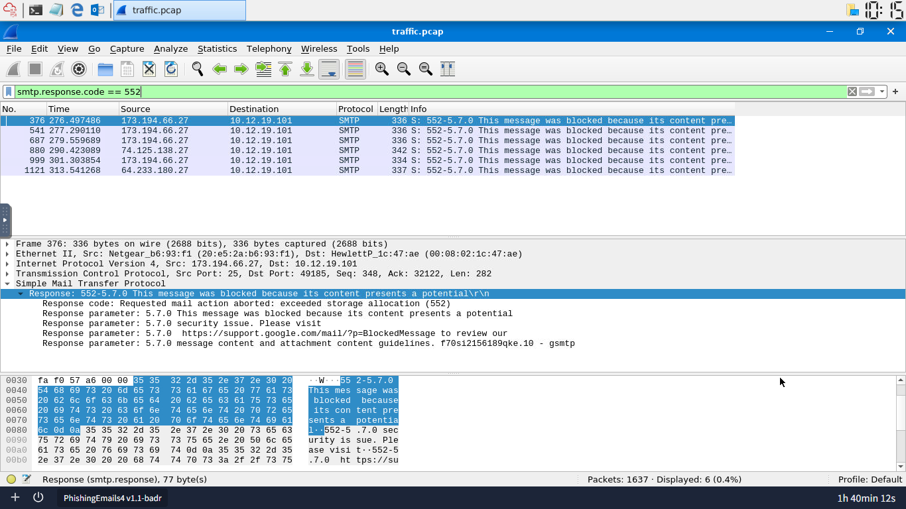
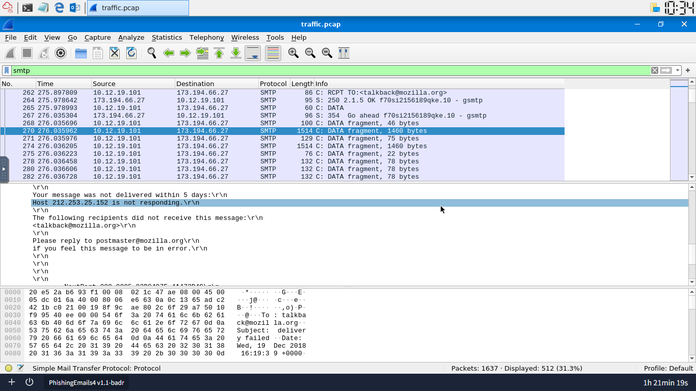
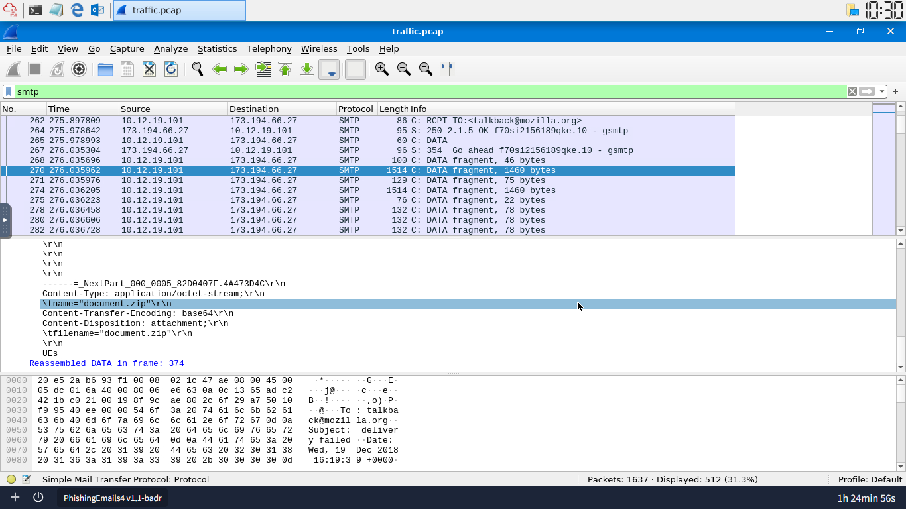
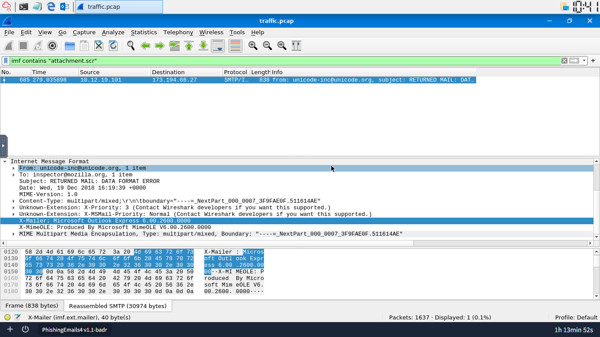

# Packet Analysis & Email Security Lab
This repository documents my hands-on analysis of network packet captures (`.pcap`) to investigate malicious mail server communications, map adversarial behavior, and extract indicators of compromise (IoCs) using Wireshark. By analyzing SMTP metrics and IMF structural attributes, I isolated specific attack vectors, identified security system bypasses, and mapped out how automated mail payloads function.

---

## Analyzing SMTP Traffic (Response Codes)

### 1. The Threat
The mail server was logging repeated delivery failures and automated filtering blocks, signs of potential spam abuse, misconfigured forwarding, or an active phishing campaign trying to push malicious payloads through the network.

### 2. Analysis & Detection Strategy
I used specific display filters to drill into the SMTP protocol's return codes. Rather than going through the capture packet by packet, I isolated checkpoints in the conversation between mail transfer agents (MTAs) to see exactly where connections succeeded and where external defensive tools rejected the inbound traffic:
* **Display Filter:** `smtp.response.code`
* **Response Code 220 Count:** `19`
* **Response Code 552 Count:** `6`

### 3. Implementation
I isolated multiple communication behaviors across the packet capture. First, applying the `smtp.response.code == 220` rule confirmed the server successfully initiated connections 19 times. Shifting focus to perimeter rejections, I uncovered an external threat intelligence block where the server returned a `553` code, dropping the email entirely because the sender's origin reputation was explicitly flagged by a public blocklist.

* **Extracted Spamhaus Error:** `553 5.3.0 Email blocked using spamhaus.org - see <http://www.spamhaus.org> 173.66.46.112`

Finally, tracking the `552` status code revealed 6 messages blocked for presenting potential security issues, due to violating content or attachment guidelines. Worth noting: RFC 5321 defines `552` generically as "exceeded storage allocation," but this server reuses the code with custom text for content and attachment enforcement instead. Reading the actual response text mattered more here than the generic code definition.

### 4. The Real-World Lesson
Monitoring edge return codes gives an immediate read on mail network health. Relying only on simple domain blocks doesn't hold up, since attackers spin up new staging infrastructure constantly. Reputation blocks like Spamhaus catch this earlier, rejecting the sender at the initial handshake before a malicious attachment ever reaches an inbox.

---

## Analyzing SMTP Traffic (Email Content & Attachments)

### 1. The Threat
An adversary initiated an inbound session to deliver a multi-part email payload carrying a hidden, potentially malicious compressed archive designed to run code once extracted.

### 2. Analysis & Detection Strategy
I dropped broad status filters and pivoted to deep content inspection, isolating the full application layer protocol and breaking down individual mail bodies to look for anomalies in encoding mechanisms, embedded attachments, and internal delivery subsystem diagnostics:
* **Total SMTP Packets:** `512`
* **Target Payload Key:** `document.zip`
* **Failed Routing Footprint:** `212.253.25.152`
* **Outdated Mail Client Signature:** `Microsoft Outlook Express 6.00.2600.0000`
* **Encoding Routine:** `base64`

### 3. Implementation
I applied a blanket `smtp` filter to see the full scope of the conversation, which exposed 512 packets available for analysis. Drilling into packet `270` exposed an automated bounce message from a mail delivery subsystem, detailing a routing failure because the host at `212.253.25.152` refused to respond. Inspecting the raw MIME headers nested inside that packet revealed a staged attachment string pointing to an archive named `document.zip`.

To trace parallel activity, I shifted filters to `imf` (Internet Message Format) and searched for specific attachment signatures like `attachment.scr`, found in a separate message. This pulled the `X-Mailer` header, an outdated `Microsoft Outlook Express` signature, on a message using `base64` encoding to hide the executable content inside the transport stream.

### 4. The Real-World Lesson
Attackers rely on binary-to-text encoding like Base64 to slip malicious binaries past basic network string filters. Catching this requires breaking down application layers and checking metadata like `X-Mailer` headers, since unusual values point to spoofing or legacy software commonly abused during targeted phishing attacks.
