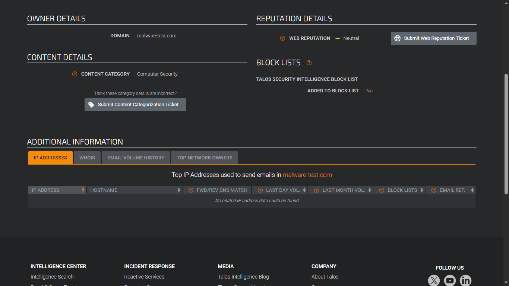
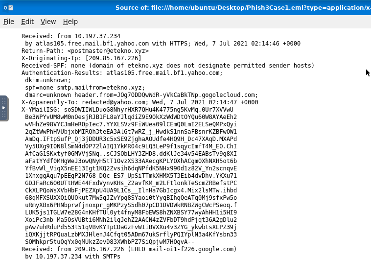
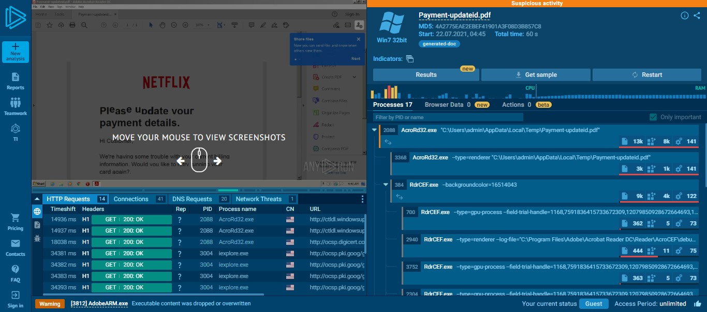
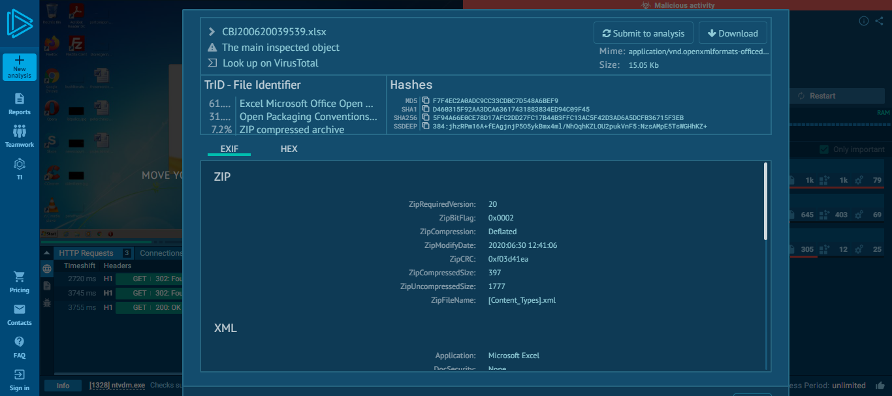
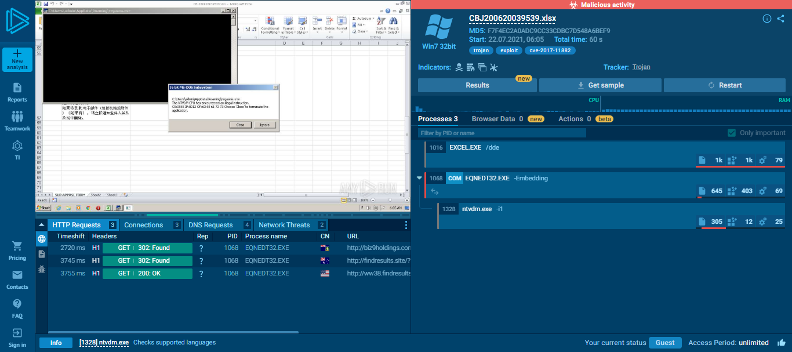
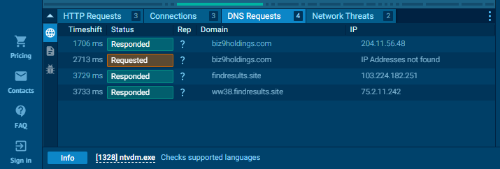

# Incident Response: Threat Intelligence and Dynamic Sandbox Analysis

This repository documents my hands-on analysis of malicious documents and phishing emails using enterprise threat intelligence and dynamic sandboxes. The goal was to move beyond static headers, leverage Cisco Talos for infrastructure profiling, and detonate weaponized payloads in ANY.RUN to extract live Command-and-Control (C2) telemetry.

---

## Threat Intelligence and Indicator Profiling
### 1. Overview
Before interacting with potential malware, an analyst must establish a risk baseline. Threat actors constantly register new, unrated domains to bypass legacy secure email gateways (SEGs) that only block explicitly blacklisted sites. Furthermore, safely hashing a file rather than executing it prevents accidental local infection.

### 2. Analysis
I used **Cisco Talos** to profile the infrastructure of a suspected campaign and verify the cryptographic signature of a suspicious attachment.

*   **Target Domain:** `malware-test.com`
*   **Talos Verdict (Domain):** `Neutral` (Confirming the attacker's use of unrated infrastructure for evasion).

*   **Target File Hash (SHA256):** `025ba9ce4a2118a9ca7b115c8869ff73bc16bad3732ba359cef1e60ad8f961f9`
*   **Talos Verdict (File):** `Malicious` (Identified under the `Phishing/PDF.Malurl.XG5` signature).

---

## Dissecting Credential Harvesting (Phish3Case1.eml)
### 1. Overview
An end-user escalated an email posing as an urgent Netflix payment error. This scenario leverages brand impersonation and artificial urgency to prompt a quick, panicked user reaction before they inspect the sender details.

### 2. Analysis
While the visual display name read `Netflix`, extracting the raw `.eml` headers revealed clear alignment mismatches across the Mail Transfer Agents (MTAs). I audited the top-level metadata to map the true delivery path:

*   **Originating IP:** `209.85.167.226`
*   **Return-Path:** `etekno.xyz`
*   **The Mismatch:** The routing path showed the email originated from an irregular `gogolecloud.com` server and bounced tracking data to `etekno.xyz`—a definitive sign of spoofing.

### 3. Findings
Inspecting the HTML behind the "UPDATE ACCOUNT NOW" button revealed the attacker's true payload destination. They masked the credential-harvesting site behind a shortened link (`https://t.co/yuxfZm8KPg?amp=1`) to blind default spam filters.

---

## Dynamic Detonation of Weaponized PDF (Payment-updateid.pdf)
### 1. Overview
PDFs can execute embedded scripts and launch external connections. To see exactly what this artifact was engineered to do, I detonated it inside the **ANY.RUN** interactive sandbox to safely monitor its process tree.

### 2. Analysis
Launching the document opened Adobe Acrobat Reader (`AcroRd32.exe`), which then immediately spawned secondary web-browser components (`RdrCEF.exe`) to force outbound traffic.

### 3. Findings (Network Telemetry)
The sandbox captured the live network indicators as the malware attempted to phone home:
*   **Anomalous Traffic:** The native Windows networking process (`svchost.exe`) generated a **Potentially Bad Traffic** alert for an `ET INFO TLS Handshake Failure`. This indicates the malware attempted to establish a non-standard, encrypted transport tunnel.
*   **C2 Connection:** The process successfully established an unauthorized connection to `185.221.16.143`.

---

## Tracking Memory Corruption Exploits (CBJ200620039539.xlsx)
### 1. Overview
This attack bypassed standard macro-based security rules entirely. Instead, the malicious spreadsheet was engineered to exploit a legacy systemic vulnerability (**CVE-2017-11882**) directly within Microsoft Office's memory.

### 2. Analysis
The sandbox process tree captured the exact chain of exploitation:
*   **Process Hijack:** Opening the spreadsheet forced `EXCEL.EXE` to launch an outdated, vulnerable background utility: `EQNEDT32.EXE` (Microsoft Equation Editor).
*   **Execution:** Because Equation Editor lacks modern OS memory protections, the payload successfully triggered a buffer overflow, hijacked the application control flow, and spawned `ntvdm.exe` to execute the core malware.

### 3. Findings (Infrastructure Mapping)
Following the memory exploit, the hijacked process initiated real-time DNS queries to connect with the external operational infrastructure. I extracted the primary staging zones:
*   **Primary C2 Target:** `biz9holdings.com` (Resolved to `204.11.56.48`)
*   **Secondary Staging:** `findresults.site` (Resolved to `103.224.182.251`)

---

## The Real-World Lesson
Modern phishing campaigns frequently move past simple credential harvesting and macro-enabled documents, opting instead to target application memory directly. For defenders, robust host process monitoring is critical. When a standard application like Excel spawns an out-of-process legacy tool that immediately initiates outbound web traffic, it is a high-confidence indicator of active exploitation.