# PicoSecure Threat Simulation and Detection Lab

This repository documents my hands-on experience acting as a Detection Engineer during an iterative threat simulation exercise against an adversary named "Sphinx".

---

## Task 1: Breaking File Hashes (The Bottom of the Pyramid)

### 1. The Threat
The adversary executed a malicious binary named `sample1.exe`.

### 2. Analysis & Detection Strategy
I focused on the file's cryptographic signature. Why? Because filenames are incredibly easy for an attacker to fake or change in two seconds, but a unique digital fingerprint tells the real story:
* **SHA256 Hash:** `9c550591a25c6228cb7d74d970d133d75c961ffed2ef7180144859cc09efca8c`

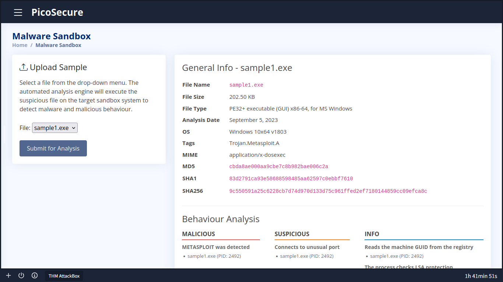

### 3. Implementation
I took that exact hash and fed it directly into PicoSecure's **Manage Hashes** blocklist to make the malware dead on arrival the moment the system recognized it.

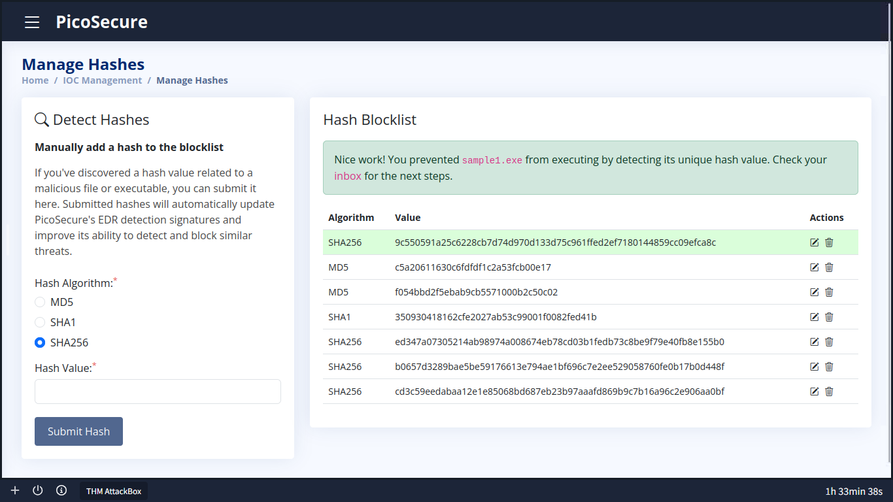

### 4. The Real-World Lesson
Hashes are highly precise, but they are fragile. Think of it like a barcode; if the attacker modifies just one tiny bit of code and recompiles it, the file gets a completely new hash. That’s why static blocks are easy to bypass; the attacker just swapped the build and walked right past the rule.

---

## Task 2: Escalating to Network Indicators (Moving Up the Pyramid)

### 1. The Threat
The adversary deployed `sample2.exe`. Because they tweaked the signature, my previous hash blocklist rule didn't even blink.

### 2. Analysis & Detection Strategy
Since tracking the file directly failed, I zoomed out to look at what it was doing at runtime. Telemetry inside the sandbox revealed the malware immediately trying to phone home to its outbound command center:
* **Malicious Destination:** `154.35.10.113:4444`

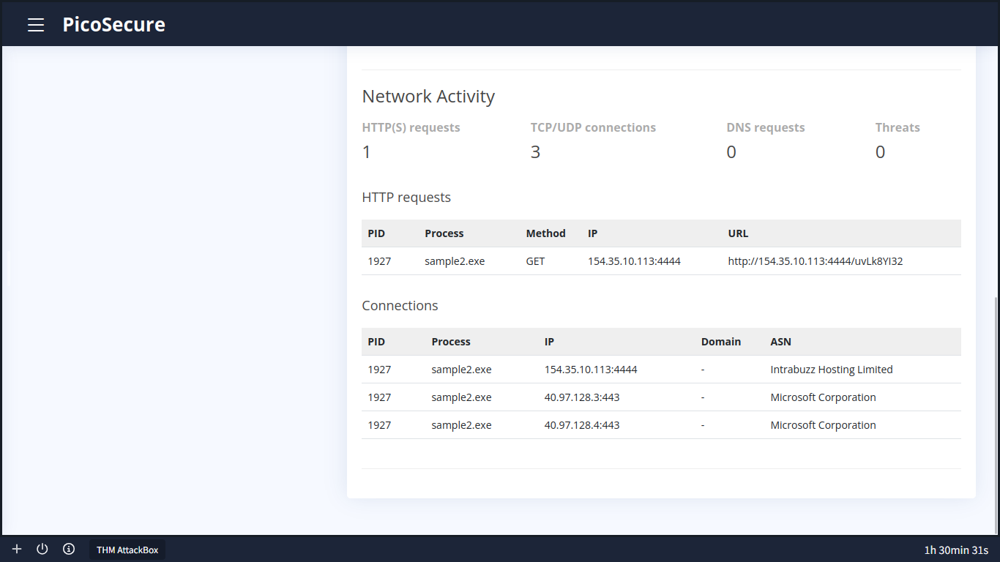

### 3. Implementation
Instead of playing guessing games with the file itself, I shut down the communication lane. I configured a hard network-level block inside the **Firewall Rule Manager**:
* **Type:** Egress (Outbound)
* **Source:** Any
* **Destination IP:** `154.35.10.113`
* **Action:** Deny

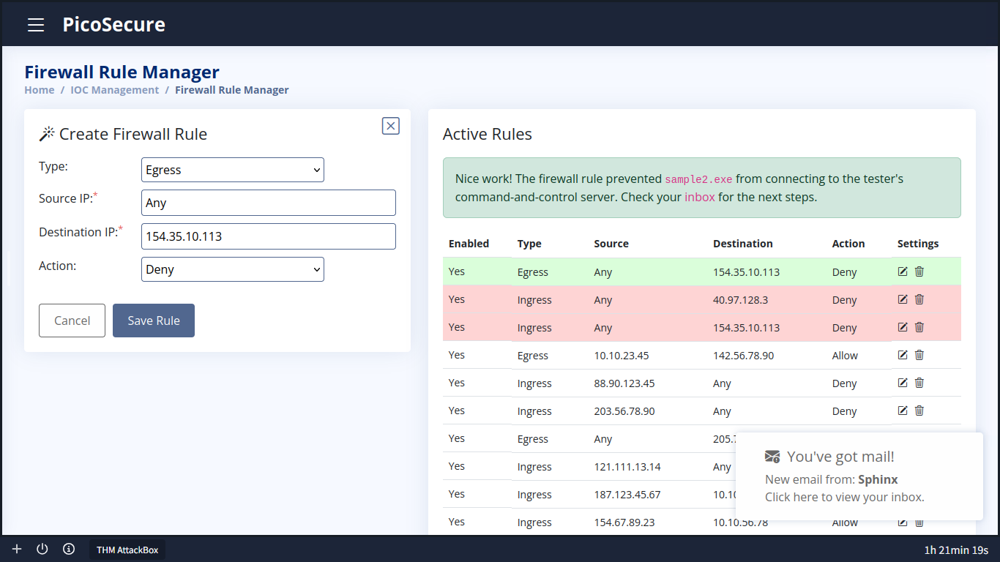

### 4. The Real-World Lesson
Moving up the Pyramid of Pain to network indicators gives you a much wider net. The malware can change its name or signature all day long, but as long as its code tells it to call home to that specific IP address, it remains completely trapped.

---

## Task 3: Defeating IP Rotation via Domain Names

### 1. The Threat
The adversary bypassed the firewall block by deploying `sample3.exe`, which dynamically cycles through backup public cloud IP addresses to stay under the radar.

### 2. Analysis & Detection Strategy
Instead of playing whack-a-mole trying to block shifting IPs one by one, I targeted the underlying infrastructure indicator. The malware still needs a fixed address to look up those IPs, leading me to its malicious domain registration:
* **Malicious Domain:** `emudyn.bresonicz.info`

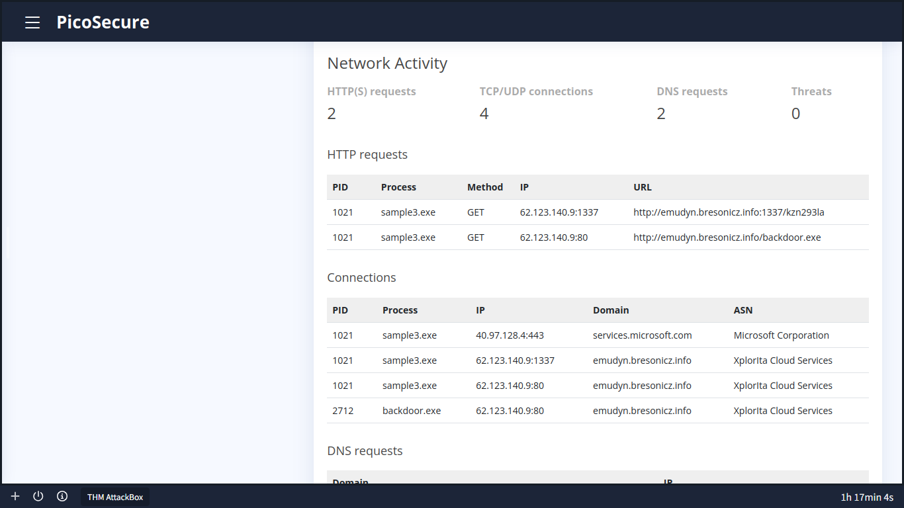

### 3. Implementation
I cut the problem off at the root by setting up a centralized domain-filtering block inside the **DNS Rule Manager**:
* **Domain Name:** `emudyn.bresonicz.info`
* **Action:** Deny

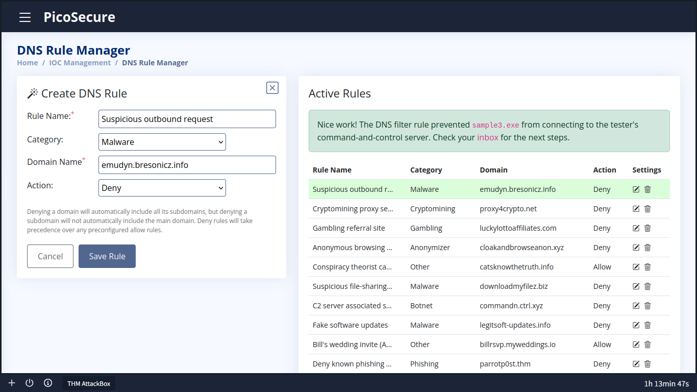

### 4. The Real-World Lesson
Domains sit higher on the pyramid because they increase operational friction for the attacker. Forcing an adversary to purchase new domains, re-register infrastructure, and update their code slows their entire campaign down significantly.

---

## Task 4: Monitoring Host Artifacts (Sigma & Registry Modifications)

### 1. The Threat
The adversary shifted away from network indicators entirely and executed `sample4.exe`, focusing on blinding local host security from the inside out.

### 2. Analysis & Detection Strategy
I audited host telemetry to catch what the malware was doing locally. The logs caught it red-handed making unauthorized changes directly to the endpoint registry to shut down real-time protection:
* **Registry Key:** `HKEY_LOCAL_MACHINE\SOFTWARE\Microsoft\Windows Defender\Real-Time Protection`
* **Name:** `DisableRealtimeMonitoring`
* **Value:** `1`

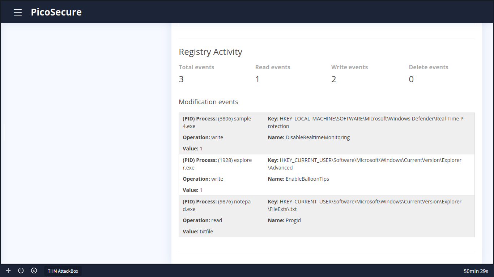

### 3. Implementation
I wrote a **Sigma Rule** to monitor Sysmon event logs and flag this exact behavioral modification. This maps directly to **MITRE ATT&CK T1562.001** (Impair Defenses: Disable or Modify Tools).

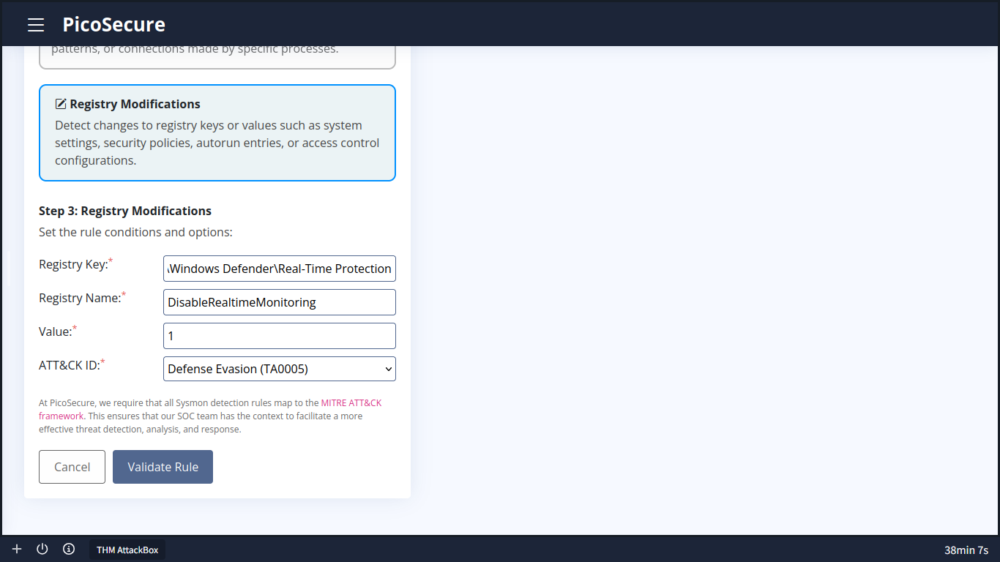

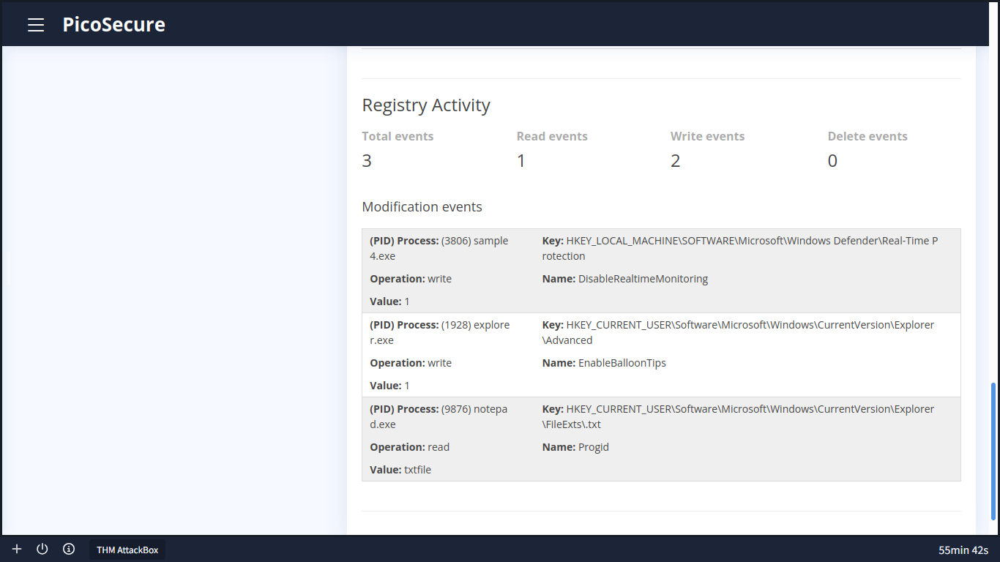

### 4. The Real-World Lesson
Detecting host artifacts focuses on the actual physical footprints an application leaves behind in a system's registry or filesystem. The malware can mask its network traffic, but it cannot hide the structural changes it has to make to break your host.

---

## Task 5: Identifying Behavioral Patterns (C2 Beaconing)

### 1. The Threat
The adversary deployed `sample5.exe`, moving their heavy execution to back-end systems while dynamically varying network protocols to dodge standard, fixed detection parameters.

### 2. Analysis & Detection Strategy
Instead of looking for a static value, I analyzed Sysmon network logs over a broad 12-hour window to spot consistency. Sure enough, a clear, automated **Command & Control (C2) Beaconing** heartbeat emerged:
* **Target IP:** Dynamic / Wildcard (`any`)
* **Fixed Connection Size:** `97 bytes`
* **Interval Frequency:** Exactly every 1800 seconds (30 minutes)

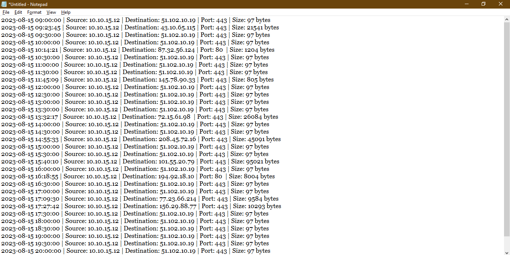

### 3. Implementation
I engineered a behavioral analytics rule under Sysmon Network Connections designed to isolate these exact timing and size anomalies, mapping back to **MITRE ATT&CK T1071** (Standard Application Layer Protocol).

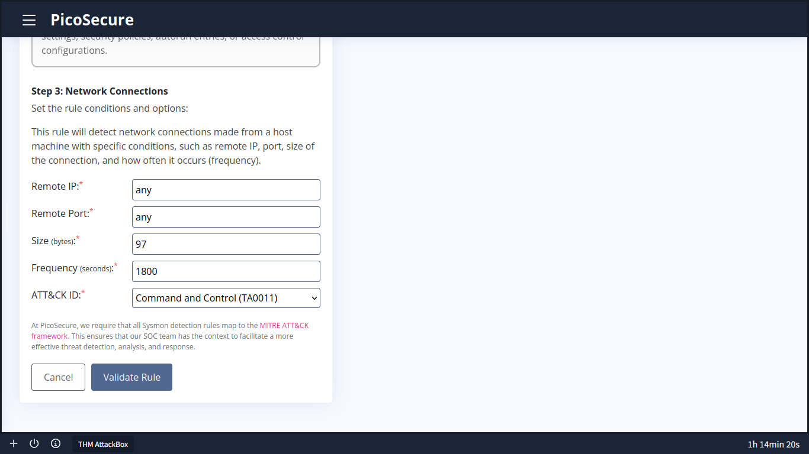

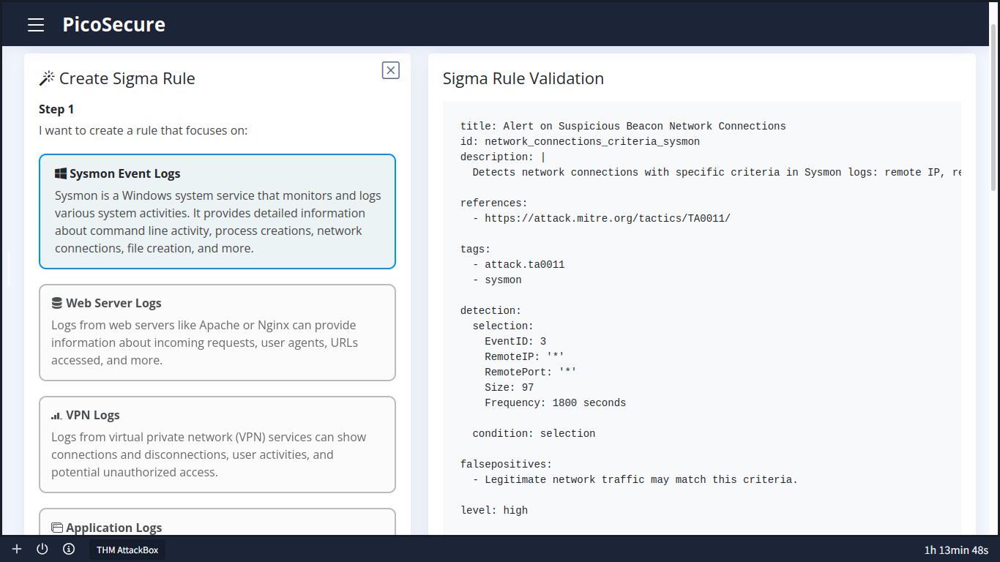

### 4. The Real-World Lesson
At the higher echelons of the Pyramid of Pain, you completely stop chasing static indicators. Instead, you target the fundamental, unavoidable operational behaviors of the attacker's software. 

---

## Task 6: Disrupting Adversary TTPs (The Peak of the Pyramid)

### 1. The Threat
The adversary deployed `sample6.exe`, using highly modular backend tools to run local host reconnaissance completely detached from predictable file signatures or fixed network traffic.

### 2. Analysis & Detection Strategy
Rather than tracking malware code, I audited the human attacker's behavioral habits inside `commands.log`. Upon gaining access, the operator subconsciously executed an automated sequence of system discovery commands, appending all the outputs to a specific staging file on disk:
* **Subconscious Signature:** `>> %temp%\exfiltr8.log`

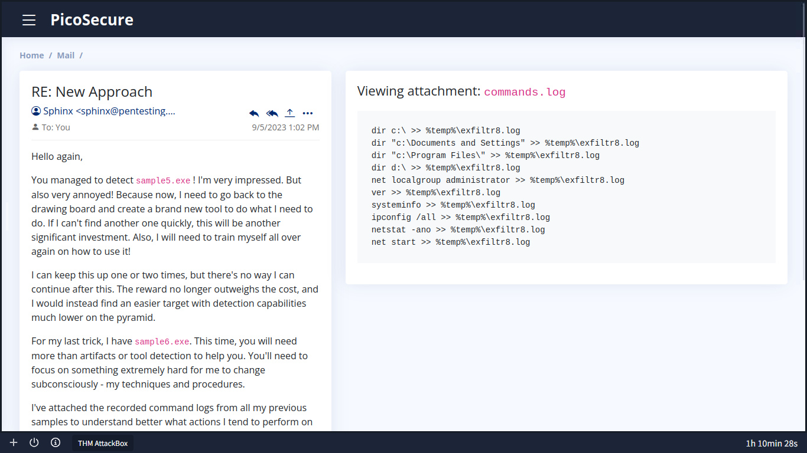

### 3. Implementation
I used the **Sigma Rule Builder** to track Sysmon Event ID 1 (Process Creation) to kill the automated script execution style directly:
* **Process Name:** `cmd.exe`
* **CommandLine String:** `exfiltr8.log`
* **MITRE ATT&CK ID:** `T1119` (Automated Collection)

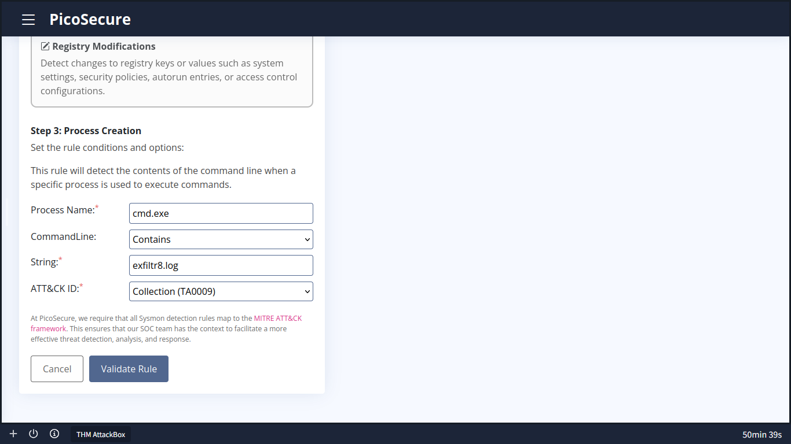

### 4. The Real-World Lesson
Targeting Tactics, Techniques, and Procedures (TTPs) is the absolute peak of defense. By engineering a detection rule around the attacker's fundamental working habits, you burn their entire playbook. Changing an operational habit forces the adversary to completely redesign their training and toolkit, successfully driving them off the network.
