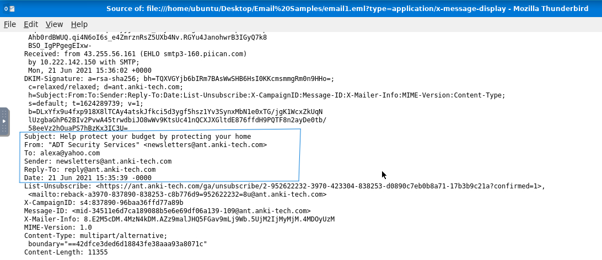
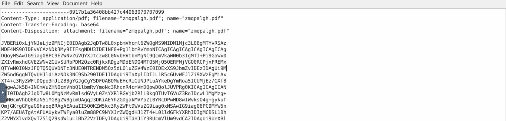
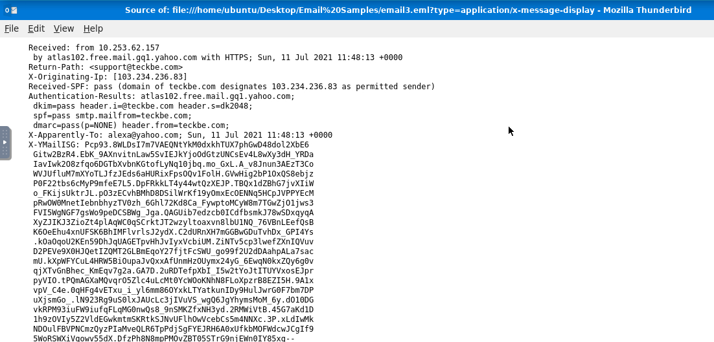

# Email Header Analysis

Three malicious email samples were analyzed to extract routing indicators and decode hidden attachments. I used Thunderbird's raw message view to access the header data that the standard inbox view hides.

---

## Task 1: Tracing Sender Infrastructure (email1.eml)

### 1. The Threat
An email arrived with a suspicious subject line. The sender's display name and claimed origin needed to be verified against the actual delivery path.

### 2. Analysis & Detection Strategy
The visible sender fields in any email (name, address, subject) are fully controlled by whoever sent it. The actual routing data lives in the raw message headers. I opened the file in Thunderbird using `Ctrl + U` to access those headers and identify where the message truly came from.

### 3. Findings
* **Full Subject Line:** `Help protect your budget by protecting your home`
* **X-Originating-IP:** `43.255.56.161`

---

## Task 2: Decoding a Hidden Attachment (email2.txt)

### 1. The Threat
The email contained a file attachment embedded directly in the message source using Base64 encoding. Base64 converts binary file data into plain text so it can travel through email systems, which also means it can carry a malicious file disguised as a block of unreadable characters.

### 2. Analysis & Detection Strategy
I opened the raw file and read the MIME headers to identify the attachment's declared file type and name. The Base64 data block itself appears as a long string of random characters, but the MIME section labels it clearly before it begins.

### 3. Findings
* **Content-Type:** `application/pdf`
* **Attachment Name:** `zmqpalgh.pdf`

### 4. Decoding
I extracted the Base64 data block and ran it through a decoder to rebuild the original file.
* **Recovered Value:** `THM{BENIGN_PDF_ATTACHMENT}`

---

## Task 3: Mapping a Brand Impersonation Attack (email3.eml)

### 1. The Threat
A well-known brand was being impersonated to create a false sense of trust and pressure the recipient into reacting quickly without checking the sender details.

### 2. Analysis & Detection Strategy
Before analyzing any links or IP addresses from a malicious email, those indicators need to be **defanged**: modified so they cannot accidentally trigger a live connection during investigation. The standard format changes `http://` to `hxxp[://]` and wraps dots in brackets (e.g., `103[.]234[.]236[.]83`). After defanging, I reviewed the authentication and routing headers to map the actual sending infrastructure.

### 3. Findings
* **Impersonated Brand:** `PayPal`
* **True Sender Address:** `support@teckbe.com`
* **Defanged Originating IP:** `103[.]234[.]236[.]83`
* **Receiving Mail Server:** `atlas102.free.mail.gq1.yahoo.com`

---

## The Real-World Lesson
Email headers are written by mail servers along the delivery path, not by the sender. The display name and sender address in the inbox view are both fully editable by whoever composed the email. Cross-checking the `X-Originating-IP` against the `Authentication-Results` from the receiving server reveals whether the claimed sender identity matches the actual sending infrastructure.
