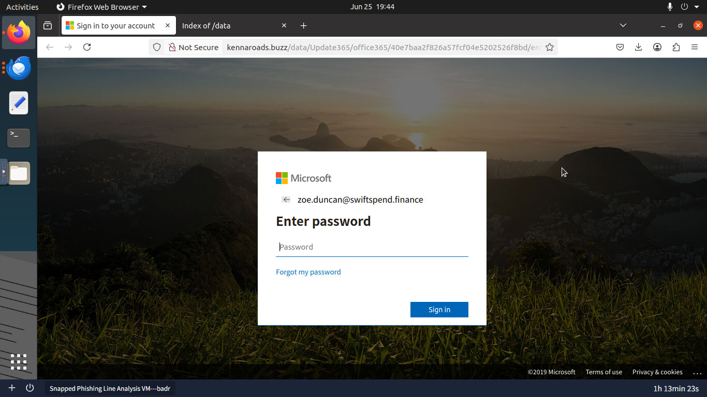
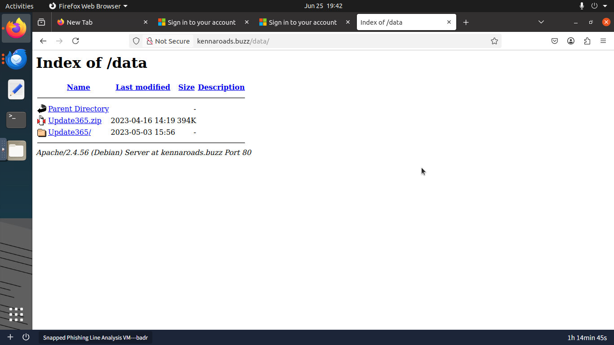
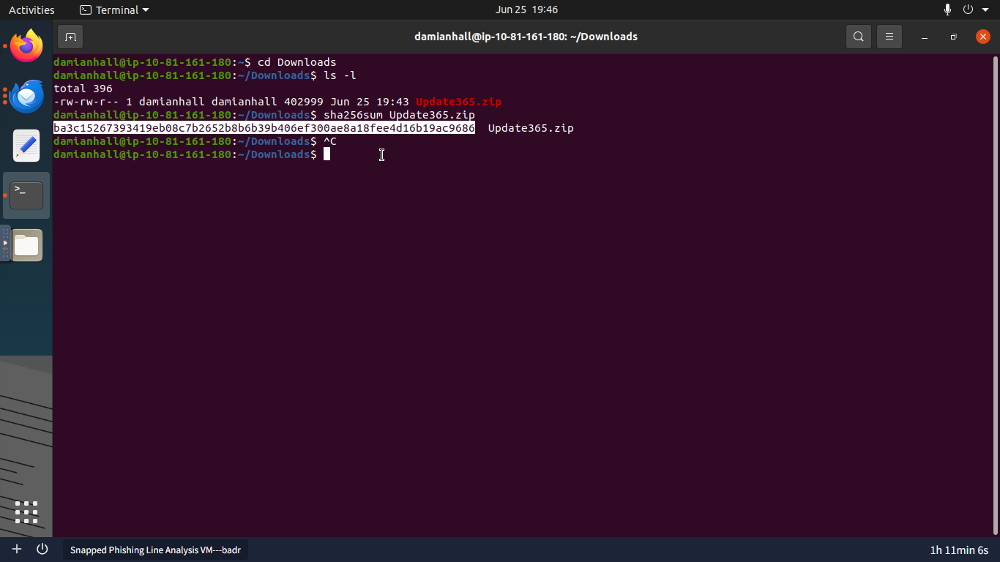
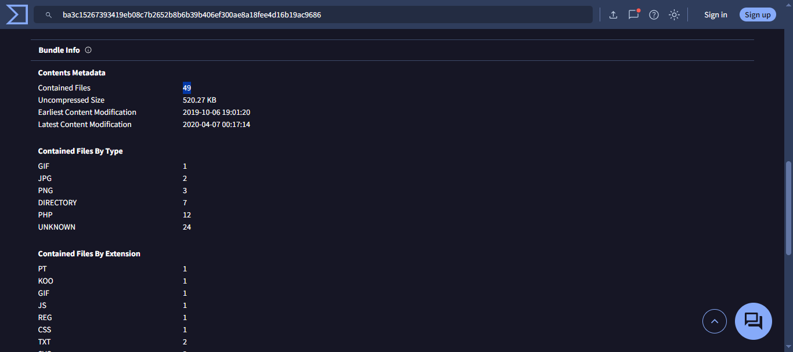
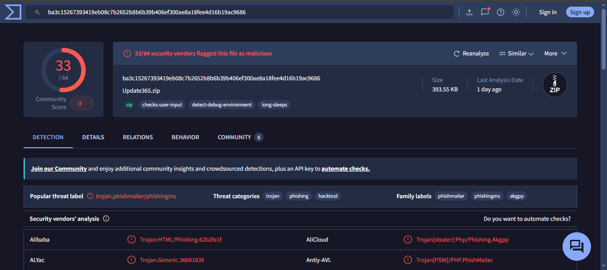
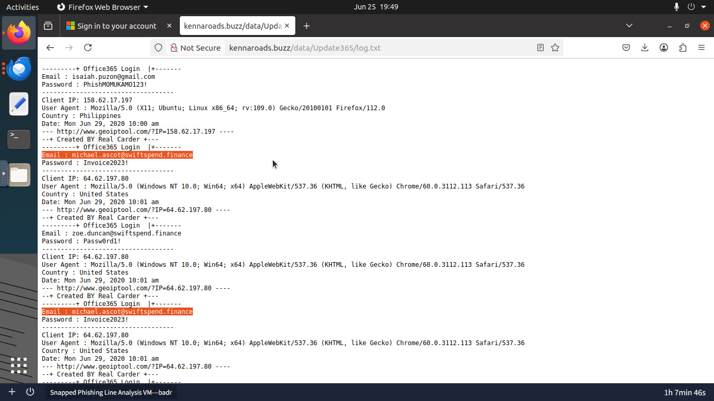
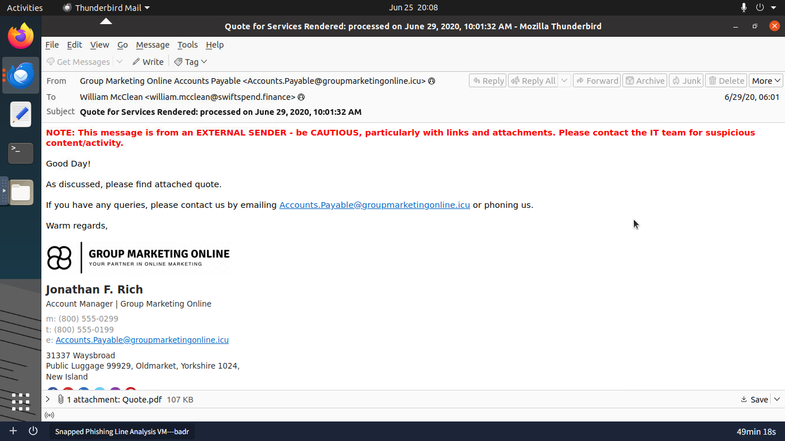
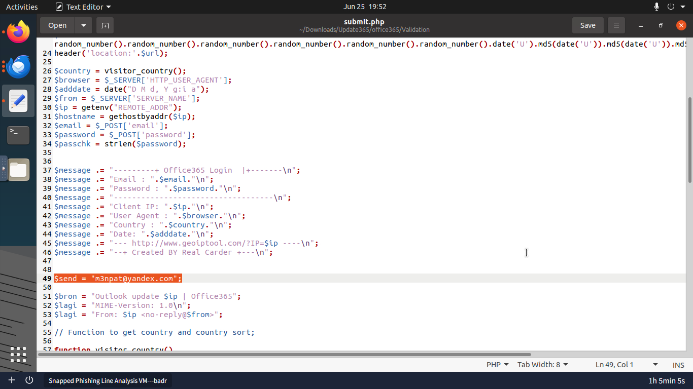

# Phishing Kit Investigation: SwiftSpend Financial

Multiple employees at SwiftSpend Financial received phishing emails impersonating a known business contact. Several had already clicked the attachment by the time the incident was escalated. I investigated the full chain: from the initial email, through the attacker's redirect infrastructure, to downloading and reverse-engineering their backend phishing kit.

---

## Task 1: Identifying the Campaign Targets

### 1. The Threat
The attacker sent emails to multiple internal departments, using a business contact name as cover to make the request appear routine.

### 2. Analysis & Detection Strategy
I opened the raw `.eml` files from the `phish-emails` directory in Thunderbird to read the actual header data. The goal at this stage was to map who was targeted and confirm the true sender address rather than the display name shown in the inbox.



### 3. Findings
* **Target Recipient:** `William McClean`
* **Attacker's Sending Address:** `Accounts.Payable@groupmarketingonline.icu`

---

## Task 2: Tracing the Redirect and the Cloned Login Page

### 1. The Threat
The phishing email delivered an HTML attachment designed to redirect the user to an external site that looked exactly like the Microsoft Office 365 login page. The goal was to capture credentials the moment the user tried to "sign in."

### 2. Analysis & Detection Strategy
I opened the attachment belonging to internal user `Zoe Duncan` in a secure browser session and followed the redirect chain to identify the domain hosting the fake login page.



### 3. Findings
* **Redirect Domain:** `kennaroads.buzz`
* **Impersonated Brand:** Microsoft (Office 365 login portal)

The domain `kennaroads.buzz` has no prior reputation history, which is intentional. Attackers frequently register fresh domains with no detection history to avoid reputation-based email and web filters that only block known-bad addresses.

---

## Task 3: Server Directory Exposure and Kit Download

### 1. The Threat
The attacker made a common deployment mistake: they left directory browsing enabled on their web server. This means anyone who knows the server path can view and download the files hosted there, including the attacker's own tools.

### 2. Analysis & Detection Strategy
I stripped the URL back to the `/data` path to check whether the server would expose its file index. It did. This is a misconfiguration on the attacker's side, not an exploit on mine — the server was simply left open.



### 3. Findings
The directory listing revealed the full backend deployment. I downloaded the archive and computed its hash to identify it without extracting the contents first.

* **Exposed Archive:** `Update365.zip`

```bash
sha256sum Update365.zip
```

* **SHA256 Hash:** `ba3c15267393419eb08c7b2652b8b6b39b406ef300ae8a18fee4d16b19ac9686`



---

## Task 4: Threat Intelligence on the Phishing Kit

### 1. The Threat
A phishing kit is a pre-packaged bundle of files (HTML pages, CSS, PHP scripts) that an attacker deploys to a server to run a credential harvesting operation. Checking it on VirusTotal tells you whether it has been seen before and what other analysts have categorized it as.

### 2. Analysis & Detection Strategy
I submitted the SHA256 hash to **VirusTotal** to check vendor classifications and inspect the file listing inside the archive without extracting it.





### 3. Findings
* **VirusTotal Category:** `hacktool`
* **Total Files Inside Archive:** 49

---

## Task 5: Reading the Live Victim Log and the Exfiltration Code

### 1. The Threat
Once credentials are submitted through the fake login page, the phishing kit needs to store or send them somewhere. Accessing the attacker's live log file exposes which victims have already been compromised. Reading the kit's source code shows exactly where those credentials are being sent.

### 2. Analysis & Detection Strategy
I navigated directly to the live log file at `/data/Update365/log.txt` on the attacker's server to check for captured credentials. I then extracted the kit archive locally and opened `submit.php` in a text editor to trace the exfiltration logic.





### 3. Findings
* **Compromised Account Found in Log:** `michael.ascot@swiftspend.finance`
* **Attacker's Collection Email:** `m3npat@yandex.com`

The `submit.php` script captures whatever credentials the victim enters and sends them directly to `m3npat@yandex.com`. Every time someone submits the fake login form, the attacker receives an email with those credentials.

---

## Task 6: Incident Response & Remediation

### 1. Immediate Containment
* **Reset compromised credentials immediately:** `michael.ascot@swiftspend.finance` is confirmed in the attacker's log. Any other accounts that interacted with the phishing page should also be treated as compromised until verified.
* **Block `kennaroads.buzz` at the web gateway:** Any internal machine that visited this domain may have submitted credentials. Pull web proxy logs and identify all internal IPs that made requests to it.
* **Block `groupmarketingonline.icu` at the email gateway:** Add the attacker's sending domain to the inbound blocklist to stop further campaign emails from reaching users.

### 2. Scope Assessment
* Search web proxy and DNS logs for all internal hosts that resolved or connected to `kennaroads.buzz`.
* Cross-reference those hosts with the victim log at `/data/Update365/log.txt` to identify every account whose credentials were captured.
* Notify each affected user, force a password reset, and check for any account activity that occurred after the credential submission timestamp.

### 3. Hardening & Prevention
* **Enforce attachment scanning:** The initial delivery was an HTML attachment. Configuring the email gateway to scan or strip HTML attachments from external senders would have blocked the entry point.
* **Enable web category filtering:** A newly registered `.buzz` domain with no prior traffic history should trigger a warning or block at the web proxy level before a user can reach it.
* **User awareness:** Brief all departments on recognizing Office 365 login pages delivered through email attachments. Legitimate Microsoft authentication never originates from an HTML file in an email.

### 4. Reporting
* Submit the attacker's domain (`kennaroads.buzz`), sending domain (`groupmarketingonline.icu`), and kit hash to VirusTotal and relevant abuse registrars.
* Report `m3npat@yandex.com` to Yandex abuse for hosting a credential collection account.
* Document all IOCs and file an internal incident report covering the scope of affected accounts.

---

## IOC Summary

| Type | Value | Verdict |
|---|---|---|
| Attacker Email | `Accounts.Payable@groupmarketingonline.icu` | Malicious sending address |
| Redirect Domain | `kennaroads.buzz` | Credential harvesting site (Microsoft clone) |
| Kit Archive | `Update365.zip` | Phishing kit (`hacktool`, 49 files) |
| SHA256 Hash | `ba3c15267393419eb08c7b2652b8b6b39b406ef300ae8a18fee4d16b19ac9686` | Confirmed malicious |
| Compromised Account | `michael.ascot@swiftspend.finance` | Credentials captured in attacker log |
| Attacker Collection Email | `m3npat@yandex.com` | Exfiltration destination in `submit.php` |

---

## MITRE ATT&CK Mapping

| Technique ID | Name | Observed Behavior |
|---|---|---|
| T1566.002 | Phishing: Spearphishing Link | HTML attachment redirecting users to a fake login page |
| T1036 | Masquerading | Cloned Microsoft Office 365 portal hosted on unrelated domain |
| T1056.003 | Input Capture: Web Portal Capture | Fake login form collecting submitted credentials |
| T1048 | Exfiltration Over Alternative Protocol | `submit.php` forwarding credentials to `m3npat@yandex.com` |
| T1583.001 | Acquire Infrastructure: Domains | Fresh unrated domain (`kennaroads.buzz`) registered to avoid reputation filters |

---

## The Real-World Lesson
Phishing kits lower the barrier for attackers because the hard work is already done. The attacker just deploys a pre-built package, configures an email address to collect results, and sends the campaign. For defenders, the most valuable finding in this investigation was not the initial email but the open server directory. A misconfigured web server handed over the full kit source code, the live victim list, and the attacker's collection email in one step. Checking for exposed directories on attacker infrastructure is a quick but high-value action during any phishing investigation.
