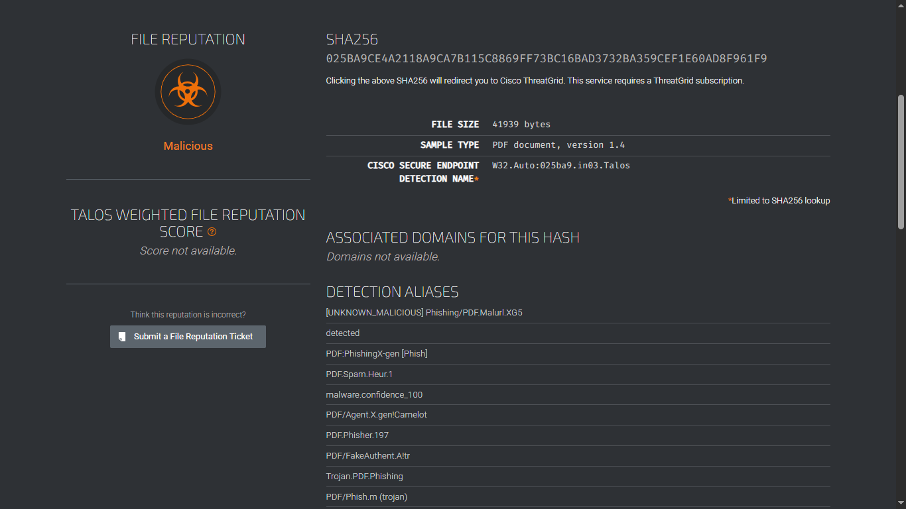
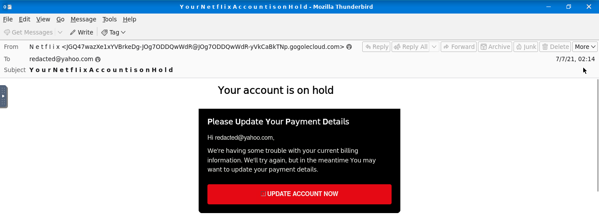
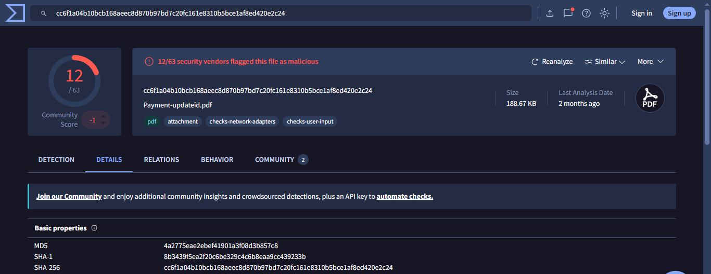
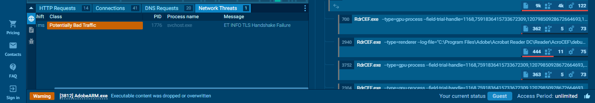

# Malware Sandbox Analysis

I used Cisco Talos to check the reputation of a domain and a file hash, then submitted three malicious files to the ANY.RUN interactive sandbox to observe their behavior in a controlled environment. Static indicators like hashes tell you what a file is. Sandbox execution tells you what it does.

---

## Task 1: Reputation Checks with Cisco Talos

### 1. The Threat
Before interacting with any suspected file, an analyst needs a baseline read on the threat. Attackers frequently register new domains with no prior history specifically to avoid filters that only block known-bad infrastructure.

### 2. Analysis & Detection Strategy
I used **Cisco Talos** to check the reputation of a suspected campaign domain and verify the hash of a suspicious attachment. A hash lookup checks whether the exact file has been seen and classified before, without requiring you to open or run it.

* **Target Domain:** `malware-test.com`
* **Talos Verdict (Domain):** `Neutral`, no prior detection history. This confirms the use of unrated infrastructure to bypass reputation-based filters.

* **File Hash (SHA256):** `025ba9ce4a2118a9ca7b115c8869ff73bc16bad3732ba359cef1e60ad8f961f9`
* **Talos Verdict (File):** `Malicious`, flagged under the signature `Phishing/PDF.Malurl.XG5`.

---

## Task 2: Credential Harvesting Email (Phish3Case1.eml)

### 1. The Threat
A user escalated an email claiming to be from Netflix, stating their account payment had failed and immediate action was required. The urgency is intentional: it pushes the user to act before checking whether the email is legitimate.

### 2. Analysis & Detection Strategy
The display name showed `Netflix`, but the raw `.eml` headers told a different story. I audited the delivery path to identify where the message actually came from.

* **Originating IP:** `209.85.167.226`
* **Return-Path Domain:** `etekno.xyz`
* **What the headers showed:** The message was routed through a server at `gogolecloud.com`, a domain designed to resemble Google Cloud at a glance, while directing reply traffic to `etekno.xyz`. Neither has any connection to Netflix.

### 3. Findings
The "UPDATE ACCOUNT NOW" button did not link to Netflix. Inspecting the HTML behind it revealed the real destination: a shortened URL (`https://t.co/yuxfZm8KPg?amp=1`) used to hide the actual credential-harvesting page from spam filters.

---

## Task 3: Malicious PDF in Sandbox (Payment-updateid.pdf)

### 1. The Threat
PDFs can contain embedded scripts that execute when the file is opened and trigger outbound connections in the background. Submitting the file to a sandbox lets you observe this behavior without risk to a live machine.

### 2. Analysis & Detection Strategy
I submitted the file to **ANY.RUN** and opened it inside the sandbox environment. Opening the document launched Adobe Acrobat Reader (`AcroRd32.exe`), which immediately spawned a secondary rendering process (`RdrCEF.exe`) that began generating outbound network traffic.

### 3. Findings
The sandbox captured the live network activity as the file executed:
* The Windows networking process `svchost.exe` generated a **Potentially Bad Traffic** alert for a `TLS Handshake Failure`. The malware attempted to open an encrypted outbound connection that did not complete successfully.
* The process did establish a confirmed unauthorized connection to `185.221.16.143`.

---

## Task 4: Memory Exploit in Sandbox (CBJ200620039539.xlsx)

### 1. The Threat
This spreadsheet bypassed macro-based defenses entirely. Rather than relying on the user enabling macros, it exploited a known vulnerability in Microsoft Office, **CVE-2017-11882**, to execute code the moment the file was opened with no further interaction required.

### 2. Analysis & Detection Strategy
I submitted the file to **ANY.RUN** and monitored the process tree as it executed. The sandbox captured the exact sequence of events:
* Opening the spreadsheet caused `EXCEL.EXE` to launch `EQNEDT32.EXE`, Microsoft Equation Editor, a background component that ships with older versions of Office and lacks modern memory protections.
* The exploit triggered a buffer overflow inside Equation Editor, redirected the application's execution flow, and spawned `ntvdm.exe` to run the actual malware payload.

### 3. Findings
After the exploit completed, the hijacked process made DNS lookups to reach its external infrastructure:
* **Primary target:** `biz9holdings.com` resolved to `204.11.56.48`
* **Secondary target:** `findresults.site` resolved to `103.224.182.251`

---

## The Real-World Lesson
Modern attacks increasingly exploit application vulnerabilities rather than relying on user mistakes like enabling macros. When a standard application like Excel spawns a legacy background utility that immediately makes outbound network requests, that process sequence is a reliable indicator of active exploitation, regardless of whether any suspicious prompt appeared.
