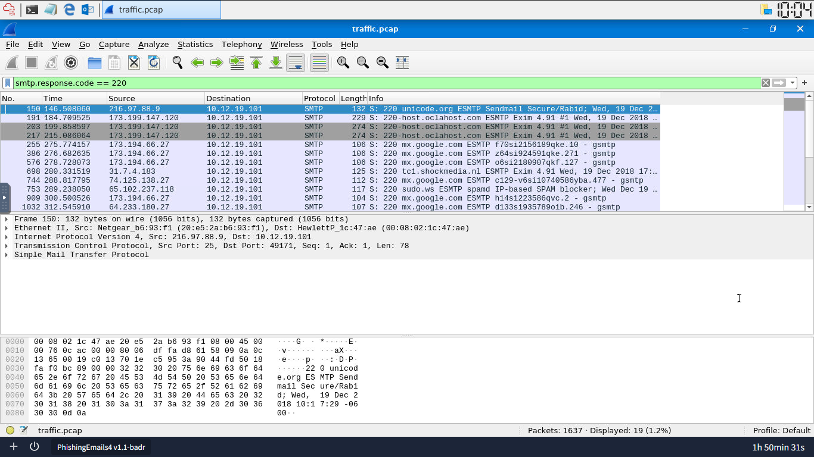
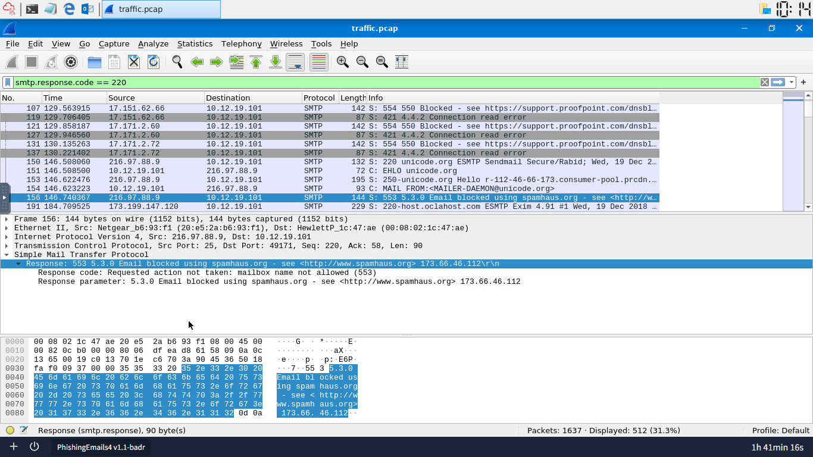

# SMTP Packet Analysis

I analyzed a network packet capture (`.pcap`) in Wireshark to investigate suspicious mail server activity. The goal was to identify blocked delivery attempts, understand why they were blocked, and extract attachment indicators from the traffic.

---

## Task 1: Analyzing SMTP Response Codes

### 1. The Threat
The mail server logs showed repeated delivery failures and automated blocks, consistent with an active campaign trying to push content through the network.

### 2. Analysis & Detection Strategy
SMTP servers respond to every command with a numeric status code. Rather than reading through every packet individually, I used a Wireshark display filter to isolate only those response codes and read the outcomes of each mail session at a glance.

* **Display Filter:** `smtp.response.code`
* **Response Code 220 Count:** `19` (successful connection handshakes)
* **Response Code 552 Count:** `6` (messages blocked for content or attachment violations)

### 3. Findings
The 19 successful `220` handshakes confirmed the server accepted that many inbound connections. Within those sessions, a `553` rejection appeared where an external reputation service blocked an email at the handshake stage, before any content was transmitted, because the sender's IP was listed on a public blocklist.

* **Block Message:** `553 5.3.0 Email blocked using spamhaus.org - see <http://www.spamhaus.org> 173.66.46.112`

The 6 `552` codes indicate messages blocked for content or attachment violations. Note: RFC 5321 defines `552` as "exceeded storage allocation," but this server uses the same code with custom response text for content enforcement. Reading the actual response text mattered more than the code's generic definition.

### 4. The Real-World Lesson
Blocking known-bad domains alone falls short because attackers routinely register new infrastructure with no prior history. Reputation services like Spamhaus address this by flagging the sender's IP at the initial connection, before any payload is transmitted.

---

## Task 2: Inspecting Email Content and Attachments

### 1. The Threat
One session in the capture delivered a multi-part email carrying a compressed archive, a common way to deliver executable files past basic content filters that only scan plaintext.

### 2. Analysis & Detection Strategy
I moved past status code filtering and inspected the full content of individual mail sessions directly, looking for attachment names, encoding methods, and unusual metadata in the message headers.

* **Total SMTP Packets:** `512`
* **Attachment Found:** `document.zip`
* **Failed Routing IP:** `212.253.25.152`
* **Mail Client Header:** `Microsoft Outlook Express 6.00.2600.0000`
* **Encoding Method:** `base64`

### 3. Findings
Applying a broad `smtp` filter exposed all 512 packets. Drilling into packet `270` revealed an automated bounce notification: the destination host at `212.253.25.152` had refused the connection. The MIME headers inside that packet referenced an attachment named `document.zip`.

Switching to an `imf` (Internet Message Format) filter and searching for `attachment.scr` found a separate message using `base64` encoding to embed an executable inside the transport stream. The `X-Mailer` header on that message identified the sending client as `Microsoft Outlook Express 6.00.2600.0000`, a version from 2001. Legitimate modern clients do not identify themselves that way, which points to a spoofed or automated sender.

### 4. The Real-World Lesson
Base64 encoding converts binary files into plain text, which is how executable content can move through systems that only handle text data. Catching it requires inspecting the actual application layer content, not just connection metadata. An outdated or mismatched `X-Mailer` value is a useful secondary signal: it often points to spoofed headers or automated sending tools.
